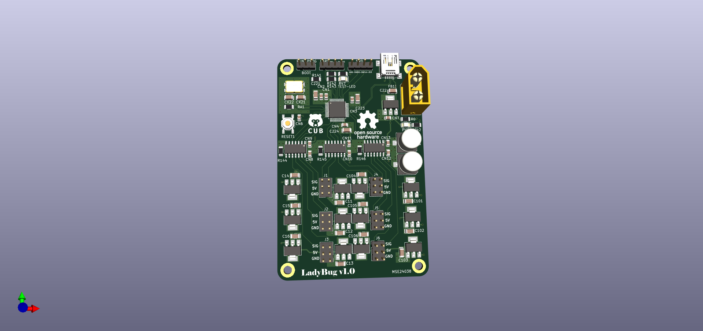

# LadyBug-v1.0
This is still a work in progress.

Mistakes were made, lessons were learned, and assembly was a nightmare but luckily my special skills of soldering flying wires came through and saved the day.
The board is fully functional and works as it should but obviously ugly. 

I'll use it to learn stm32 as I never programmed one before designing this board and it's been fun so far. Wish me luck. 

