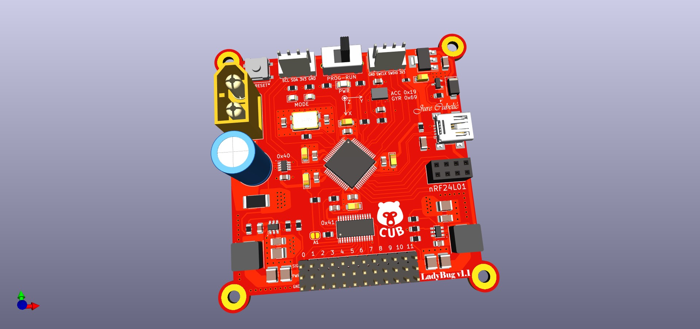
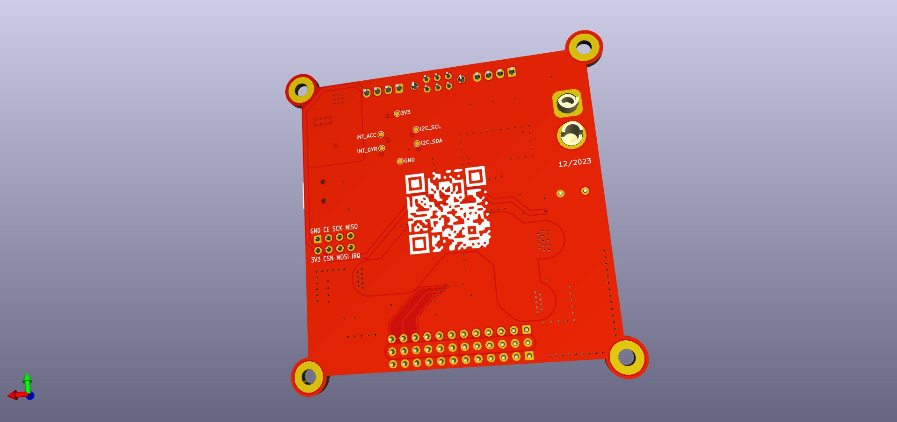
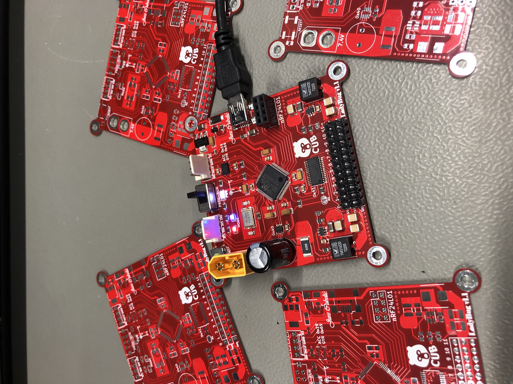

# LadyBug-v1.1

STM32F103RCT6TR-based Embedded Development Platform with IMU, Power Management, and PWM Control
<p align="center">
  
  
</p>


## Overview

This project showcases an embedded system built around the STM32F103RCT6TR microcontroller. It incorporates advanced features like an integrated Inertial Measurement Unit (IMU), efficient power management, and precise PWM control. The system is designed for learners and enthusiasts interested in STM32 programming, embedded systems, PCB design, and robotics.

## Table of Contents

- [Features](#features)
- [Getting Started](#getting-started)
- [Project Structure](#project-structure)
- [Sponsor Acknowledgment](#sponsor-acknowledgment)
- [License](#license)

## Features

1. **Microcontroller:** STM32F103RCT6, providing a powerful platform for development.
2. **Connectivity:** USB, SWD, I2C, and SPI connectors for versatile interfacing.
3. **Sensors:** Integrated BMI088 IMU and INA219 voltage/current/power sensor for precise data acquisition.
4. **PWM Control:** PCA9685 PWM driver for controlling up to 12 servos simultaneously.
5. **Power Options:** Supports both USB and LiPo batteries, featuring auto-select circuitry for seamless power management.
6. **Efficient Power Delivery:** Switched-Mode Power Supply (SMPS) ensures efficiency and is capable of delivering up to 10A.

## Getting Started

1. **Clone the repository.**
   ```bash
   git clone https://github.com/cubeli27/LadyBug

## Project Structure

- **PCB_Design:** Contains all files related to the PCB design, including Gerber files.
- **Source_Code:** Houses the source code for the embedded system project.
- **Images:** Stores project-related images, organized into subdirectories for 3D designs, assembled PCBs, and testing phases.
- **docs:** Documentation files, including the setup instructions in `INSTALL.md`.
- **LICENSE:** Licensing information for the project.
- **README.md:** The main documentation file providing an overview of the project, and features.


## Sponsor Acknowledgment

I extend my heartfelt gratitude to PCBWay for their generous support and contribution to this project. Their commitment to fostering innovation and learning in PCB Design has been instrumental in making this endeavor possible. I am very pleased with the customer support every step of the way and even more with the quality of delivered printed circuit boards.
<p align="left">
  
  
</p>

### Contact Information

For inquiries or to learn more about PCBWay, please visit [their website](https://www.pcbway.com/) or contact them at service@pcbway.com.

## License
This project is licensed under the MIT License.


