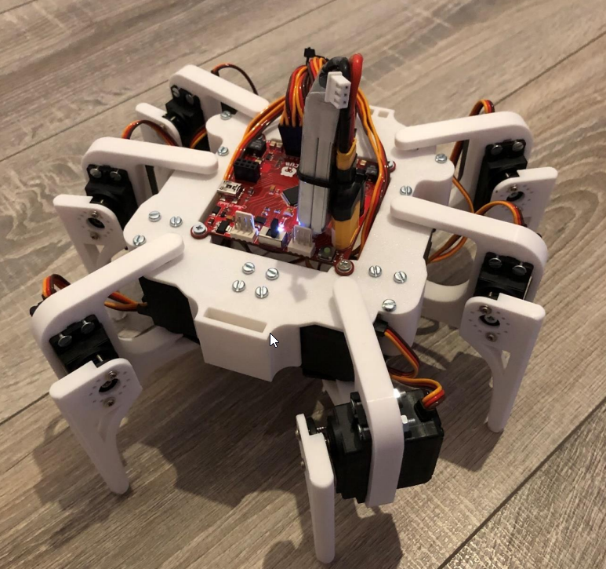
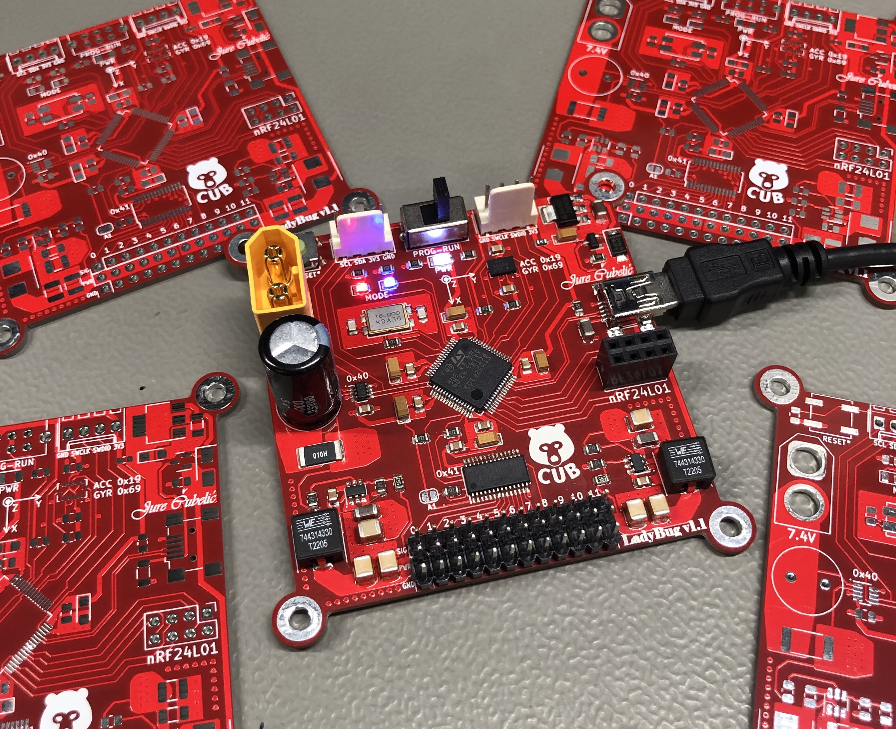

# LadyBug-v1.1

STM32F103RCT6TR-based Embedded Development Platform with IMU, Power Management, and PWM Control
<p align="center">
  
  
</p>


## Overview

This project showcases an embedded system built around the STM32F103RCT6TR microcontroller. It incorporates advanced features like an integrated Inertial Measurement Unit (IMU), efficient power management, and precise PWM control. The system is designed for learners and enthusiasts interested in STM32 programming, embedded systems, PCB design, and robotics.

## Table of Contents

- [Features](#features)
- [Getting Started](#getting-started)
- [Final Product](#final-product)
- [Project Structure](#project-structure)
- [Sponsor Acknowledgment](#sponsor-acknowledgment)
- [License](#license)

## Features

1. **Microcontroller:** STM32F103RCT6, providing a powerful platform for development.
2. **Connectivity:** USB, SWD, I2C, and SPI connectors for versatile interfacing.
3. **Sensors:** Integrated BMI088 IMU and INA219 voltage/current/power sensor for precise data acquisition.
4. **PWM Control:** PCA9685 PWM driver for controlling up to 12 servos simultaneously.
5. **Power Options:** Supports both USB and LiPo batteries, featuring auto-select circuitry for seamless power management.
6. **Efficient Power Delivery:** Switched-Mode Power Supply (SMPS) ensures efficiency and is capable of delivering up to 10A.

## Getting Started

1. **Clone the repository.**
   ```bash
   git clone https://github.com/cubeli27/LadyBug
2. **Order your own LadyBug.**
   
   To manufacture your LadyBug, access the fabrication files in "PCB_Design/fabrication". I ordered the PCBs from PCBWay and handled the assembly myself.
4. **Firmware:**

   Start using LadyBug with the template project located in "Source_Code". 

## Final Product

Here is the complete LadyBug-v1.1 robot, featuring the assembled PCB, 3D-printed body, and fully integrated servo motors. This section showcases how the finished robot looks.

<p align="center">
  
</p>

To see LadyBug in action, check out the video demonstration [here](https://youtube.com/shorts/0U5EO-w3WB0?si=tFpQQ-5Q2gVJXG-p).


## Project Structure

- **3D_Model:** Stores the 3D printed part models. (Currently not available; actual models will be added in the future)
- **Images:** Stores project-related images.
- **LadyBug1.0-files:** Relevant documentation for the first prototype. (Note: Currently irrelevant and should be disregarded.)
- **PCB_Design:** Contains PCB design-related files, including Gerber files necessary for manufacturing. 
- **Source_Code:** Houses the source code for the embedded system project.
- **LICENSE:** Licensing information for the project.
- **README.md:** The main documentation file providing an overview of the project, and features.


## Sponsor Acknowledgment

I extend my heartfelt gratitude to PCBWay for their generous support and contribution to this project. Their commitment to fostering innovation and learning in PCB Design has been instrumental in making this endeavor possible. I am very pleased with the customer support every step of the way and even more with the quality of delivered printed circuit boards.
<p align="left">
  
  
</p>

### Contact Information

For inquiries or to learn more about PCBWay, please visit [their website](https://www.pcbway.com/) or contact them at service@pcbway.com.

## License
This project is licensed under the MIT License.


